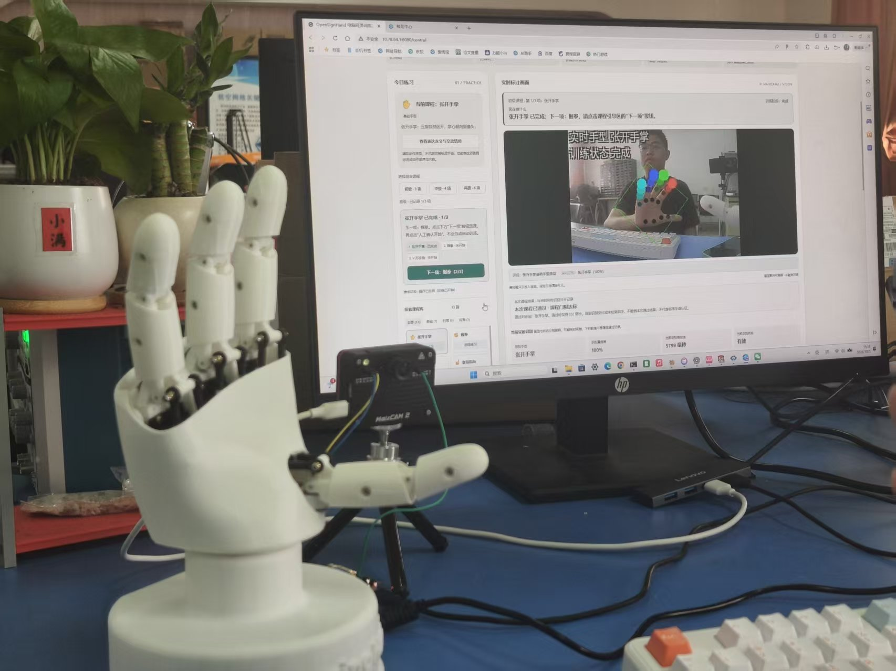
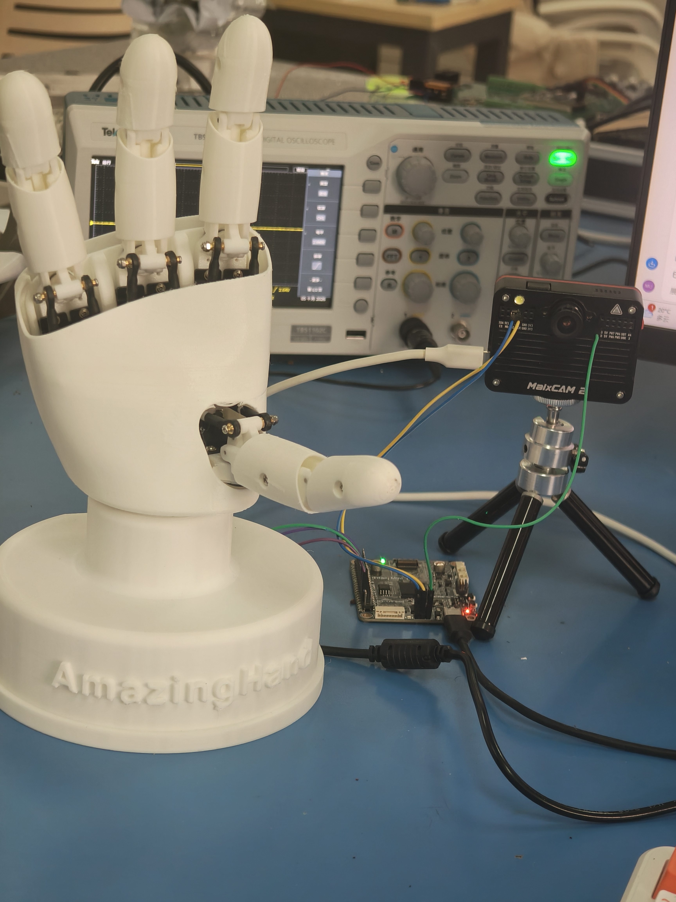
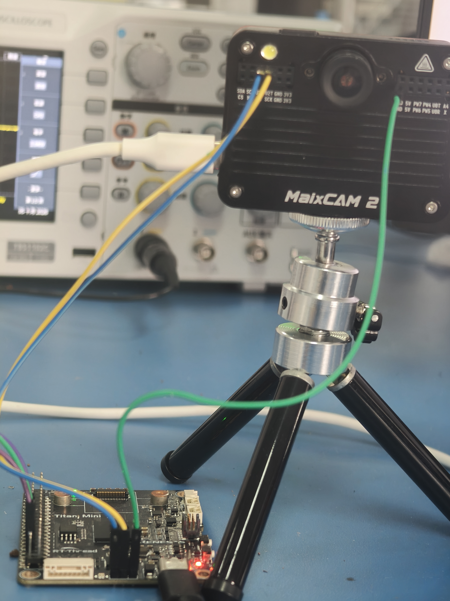
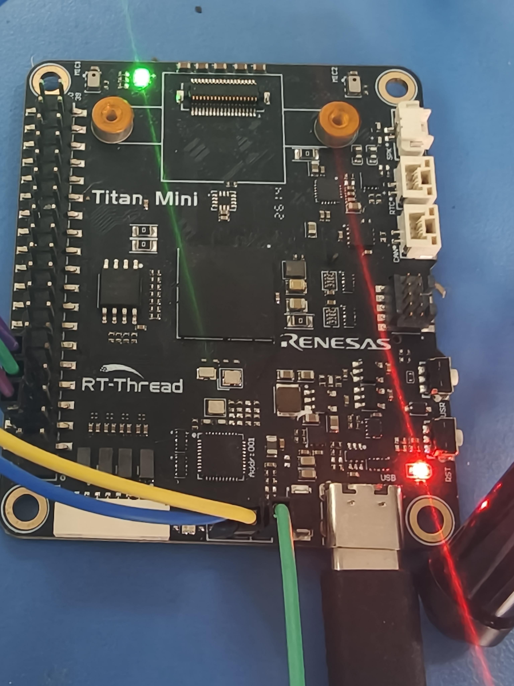

# 知手同行

AI 视觉引导的手语入门教学机器人。

知手同行把手部视觉、分步课程和开源机械手放到同一套练习流程里：选择课程，观察机械手示范，跟随提示模仿，再查看并保存练习结果。项目面向课堂配套练习和家庭自主复练，当前课程围绕基础手型和动作顺序组织。



## 功能

- **实体示范**：AmazingHand 执行预设课程动作，学习者可以观察手指姿态与动作顺序。
- **分步练习**：页面显示当前步骤、实时识别与已确认进度；完成的步骤在动作转场后保留。
- **课程与记录**：13 项练习分为初级 3 项、中级 4 项、高级 6 项，支持查看和保存报告。
- **文字沟通卡**：选择常用短句或输入文字，以大字展示给身边的人。
- **练后建议**：根据课程记录提供复练参考，页面显示建议来源；建议服务可单独配置。

课程包括基础手型 7 项、日常表达动作原型 5 项、应急辅助动作 1 项。实机演示包含中级四项练习和“你好”两步动作原型。

## 系统实物

<table>
  <tr>
    <td width="33%"></td>
    <td width="33%"></td>
    <td width="33%"></td>
  </tr>
  <tr><td align="center">机械手与节点</td><td align="center">MaixCAM2 视觉节点</td><td align="center">Titan 控制板</td></tr>
</table>

MaixCAM2 获取手部关键点，应用层完成二维手型规则与课程步骤判定；Titan 在 RT-Thread 上处理通信和机械动作，浏览器显示步骤、识别反馈和课程记录。

```text
手部画面 → 关键点与手型规则 → 课程步骤判定 → 页面反馈与记录
浏览器确认开始 → UART 课程请求 → Titan 执行动作 → 返回执行状态
```

## 快速预览

安装 Python 3.11 或更新版本，在仓库根目录运行：

```bash
git clone https://github.com/asungod/amazinghand.git
cd amazinghand
python -B -X utf8 smart_hand/host/offline_demo.py
```

打开 <http://127.0.0.1:8880/>，即可浏览课程、步骤说明、文字沟通卡和报告样例。这个入口使用离线示例数据；实机过程见[系统运行佐证](docs/submission/resources-and-validation.pdf)。端口被占用时使用 `--port 8881`。按 `Ctrl+C` 停止服务。

## 运行测试

安装 Node.js 后，在仓库根目录运行：

```bash
python -B -X utf8 smart_hand/host/run_core_tests.py
python -B -X utf8 smart_hand/host/check_maix_deploy.py --expected-mode yolo11
```

核心测试覆盖课程步骤、网页交互、报告、建议来源、视觉适配和 UART 协议，使用本机接口及设备替身。测试入口和结果说明见[测试文档](docs/TESTING.md)。

## 代码入口

| 路径 | 内容 |
| --- | --- |
| `smart_hand/maixcam2/main.py` | 视觉节点应用入口与运行配置 |
| `smart_hand/maixcam2/gesture_classifier.py` | 二维手型规则 |
| `smart_hand/maixcam2/sign_lesson.py`、`sign_sequence.py` | 课程流程、保持判定与步骤记忆 |
| `smart_hand/maixcam2/web_stream.py`、`live_sidecar.py` | 浏览器页面和交互接口 |
| `smart_hand/maixcam2/sign_session_log.py` | 课程记录 |
| `smart_hand/titan_rtthread/` | Titan 通信与机械执行源码 |
| `smart_hand/ai_course_advice_proxy.py` | 可选练后建议服务 |
| `smart_hand/host/offline_demo.py` | 无硬件界面预览 |
| `smart_hand/tests/` | 主机测试 |

设备配置、模型路径和课程开关见[部署说明](docs/DEPLOYMENT.md)。

## 项目材料

- [技术报告](docs/submission/technical-report.pdf)
- [答辩 PPT](docs/submission/presentation.pdf)
- [开源资源清单与系统运行佐证](docs/submission/resources-and-validation.pdf)
- [第三方资源清单 CSV](docs/submission/third-party-resources.csv)
- [成果内容与提交入口](docs/submission/README.md)

## 开源基础与项目工作

机械平台采用 [Pollen Robotics AmazingHand](https://github.com/pollen-robotics/AmazingHand)，视觉运行框架采用 [Sipeed MaixPy/MaixCDK](https://github.com/sipeed/MaixPy)，控制环境采用 [RT-Thread](https://github.com/RT-Thread/rt-thread)。本项目实现课程组织、二维手型规则、步骤记忆、网页交互、跨节点通信、训练记录及建议来源处理。

本项目自行编写的软件代码按 [Apache-2.0](LICENSE) 发布。第三方软件、机械设计与模型资源按各自许可使用，来源及使用方式见 [THIRD_PARTY_NOTICES.md](THIRD_PARTY_NOTICES.md)。
