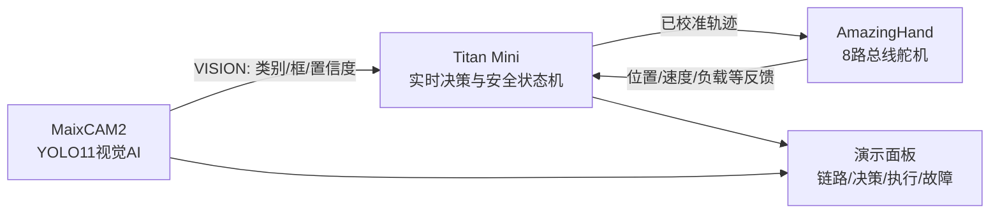

# Smart Hand 比赛讲解与演示分镜

## 1. 一句话定位

> 这是一个固定底座的双边缘智能抓握终端：MaixCAM2负责看懂物体，Titan负责把视觉
> 语义变成可审计的实时安全决策，AmazingHand负责执行并回传状态。

不使用机械臂时，不说“自主取物”“空间抓取”或“移动到目标”。操作员把物体放入已
标记的抓握区并明确授权，系统展示的是感知、决策、安全和执行闭环。

## 2. 评委面前的系统结构

当前事实边界：Maix UART4 已真机打开写成功；Titan 固件已编译但未烧录；YOLO 真机、
两板联调、舵机闭环和 Titan NPU 尚未完成。电脑面板只能作为模拟/回放原型。

## 3. 90秒讲解词

### 0–15秒：问题与架构

“很多机械手只展示预设动作。我们的重点是把视觉感知、实时安全决策和执行反馈拆成
两个边缘节点：MaixCAM2处理高带宽图像，Titan处理低延迟控制和安全状态。”

画面：指向面板四列 `AI-1 → Semantic Link → Titan → Execution`。

### 15–35秒：瓶子

“摄像头识别到瓶子，连续稳定三帧后发送结构化 VISION，而不是发送整幅图像。Titan
得到圆柱抓握意图，但此时仍不会动作，必须目标新鲜、链路在线并由操作员授权。”

画面：`bottle / 94% / CYLINDRICAL_GRASP / DISARMED`，随后授权并抓握。

### 35–55秒：遥控器

“换成遥控器后，类别变化会产生精细抓握意图；这说明动作不是固定播放，而是由端侧
识别结果选择。”

画面：`remote / PRECISION_GRASP`，机械动作差异需真机校准后才能展示。

### 55–72秒：安全降级

“现在断开视觉链路。Titan在超时后撤销授权、拒绝新动作；如果正在动作，则请求安全
停止并锁存故障。恢复链路也不能自动续作，必须重新授权并收到新目标。”

画面：`OFFLINE / FAULT / safe stop`，再恢复到 `DISARMED`。

### 72–90秒：第二级AI路线

“视觉AI回答‘这是什么’，Titan后续的执行状态模型融合视觉语义和舵机位置、速度、
负载、电压、温度，回答‘是否接触稳定或疑似卡滞’。不论模型输出如何，软限位、断联
和过载规则始终优先。”

若 Titan NPU 尚未完成，把“后续的执行状态模型”保留为路线，不说已经部署。

## 4. 三个必须演示的场景

### 场景A：正常抓握

1. 放入固定瓶子；
2. 看到稳定三帧、置信度≥70；
3. Titan显示待执行意图；
4. 操作员授权；
5. 执行后显示反馈摘要和结果；
6. 主动释放并回安全张开位。

### 场景B：视觉无效

1. 展示未支持物体或遮挡目标；
2. 面板显示 `NO_ACTION` 或目标过期；
3. 不产生新的机械动作；
4. 强调“看见不等于允许动作”。

### 场景C：链路/执行异常

1. 在无负载或安全工况下模拟断联；
2. 显示 OFFLINE、撤销授权和停止请求；
3. 恢复通信后仍保持 DISARMED；
4. 故障清除、重新授权、新目标三项缺一不可。

真实卡滞演示只允许在单指、低速、低限流、软物体和人工急停条件下进行。比赛现场
优先演示断联，不为效果故意制造整手堵转。

## 5. 拍摄/屏幕分镜

| 镜头 | 画面 | 面板必须同步显示 |
|---|---|---|
| 1 | 全景：相机、Titan、手和抓握区 | 四段链路全部在线但 DISARMED |
| 2 | 摄像头和物体近景 | 类别、置信度、稳定帧 |
| 3 | 面板特写 | VISION序号、ACK/RTT、意图、安全门 |
| 4 | 手指动作近景 | 状态 CLOSING/HOLDING，不遮挡急停 |
| 5 | 断联操作与面板 | OFFLINE、FAULT/停止请求 |
| 6 | 恢复后的全景 | DISARMED，未自动恢复动作 |

## 6. 可说与不可说

可以说：

- “双边缘架构和结构化语义链路”；
- “规则/状态机MVP已完成电脑端验证”；
- “目标、授权、断联和故障采用失效安全设计”；
- “Titan第二级AI的数据闭环和部署路线已定义”。

完成真机后才可以说：

- “YOLO11在MaixCAM2真机实时运行”；
- “两板UART链路连续运行10分钟”；
- “单指/整手完成闭环抓握”；
- “Titan NPU已部署执行状态模型”，且必须给出模型、精度、时延和资源实测。

不可说：

- “机械手自主找到并拿起任意物体”；
- “舵机负载就是精准触觉/抓力”；
- “面板模拟数据证明真机已经完成”；
- “为了双AI而重复在Titan上跑同一个YOLO”。

## 7. 演示前最终清单

- 三个固定物体及备用品，质量/尺寸记录完成；
- 相机、手和物体放置区有机械定位标记；
- 电源、线束、急停/断电方式可被操作者直接触达；
- 一键启动顺序和一键回退到 mock 模式已排练；
- 面板明确显示 LIVE 或 SIMULATION，不能混淆；
- 保存固件、模型、策略和校准表版本；
- 预先录制一段真实系统视频仅作故障备用，并明确标注录像。

