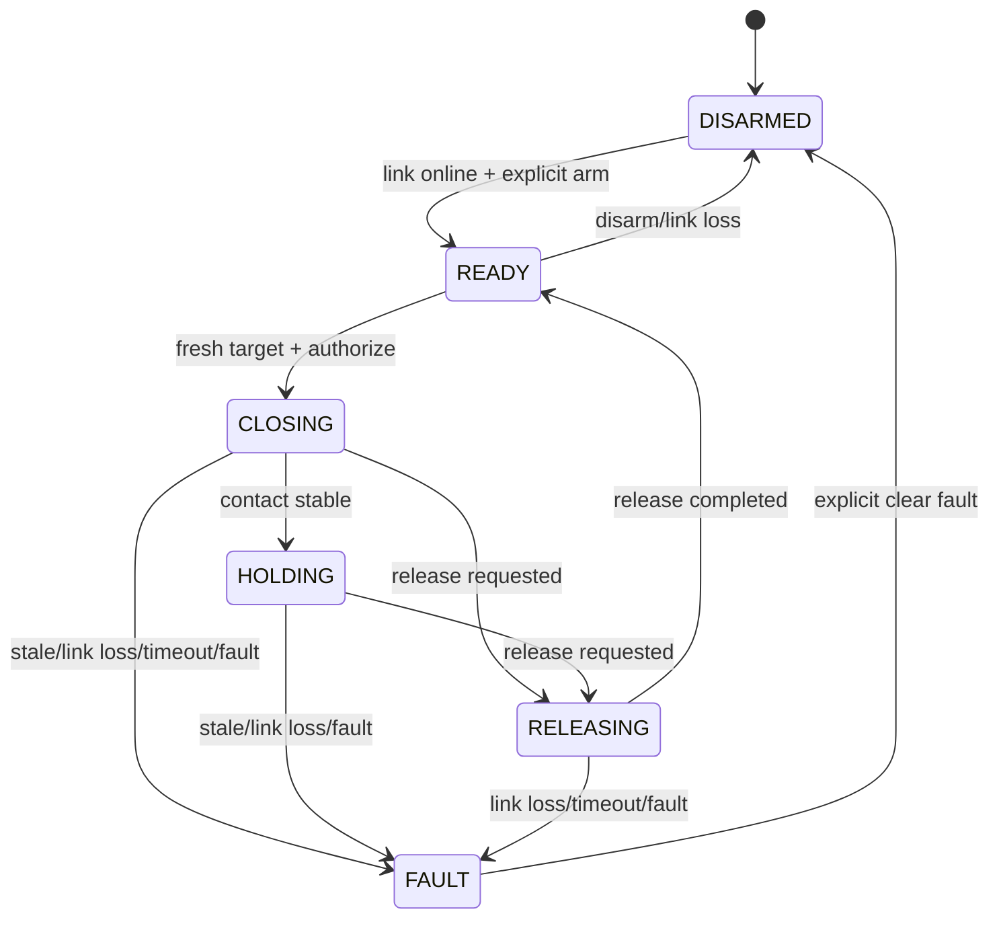

# Titan 抓握执行状态机参考设计

## 边界

`host/execution_state_model.py` 是电脑端、无舵机的参考模型，用于固定未来 Titan 动作层
的事件顺序和安全不变量。它没有加入 RT-Thread 工程，不生成总线命令，也没有决定
真实舵机的“安全停止”究竟采用保持、缓慢释放还是 torque-off。

## 状态



- `DISARMED`：上电默认，不允许动作；
- `READY`：链路在线且人工明确授权，但仍需新鲜、受支持的目标；
- `CLOSING`：正在执行预先校准的闭合轨迹；
- `HOLDING`：反馈规则或未来模型判断接触稳定；
- `RELEASING`：执行释放轨迹；
- `FAULT`：故障锁存，必须明确清除、重新授权并接收新目标。

## 不变量

- PING 在线不能代替 VISION 新鲜；
- `NO_ACTION`、重复/旧序号和过期目标不能开始抓握；
- 活动动作中的断联、目标过期和超时必须请求安全停止；
- 清除故障不会恢复原动作、原授权或原目标；
- 单调时间由调用方提供，状态机拒绝负的 elapsed；
- `safe_stop_required` 只是请求，不能当作舵机已安全停止；
- 反馈读取、日志写入和 NPU 推理不得阻塞安全状态检查。

## 当前参考超时

主机测试使用目标新鲜度 750ms、闭合 3000ms、释放 2000–3000ms。这些仅用于验证
状态转换，不是最终舵机参数。真机单指测试后必须根据低速轨迹、机械行程、总线轮询
和停止策略重新确定。

## 接入 Titan 的门槛

1. 当前通信固件先通过 J-Link 下载、UART1 控制台和 UART2 10分钟联调；
2. SCS0009 两只舵机完成唯一 ID、方向、中心和软限位校准；
3. 明确低速情况下断联、堵转和超时的实际安全停止方式；
4. 将通信、舵机轮询和状态机分成事件边界，通信线程不得直接写舵机；
5. 测试正常抓握、目标过期、断联、读回失败和释放超时；
6. 重新记录线程栈、CPU占用、UART错误和状态转换日志。

电脑端验证：

```powershell
python -m unittest tests.test_execution_state_model -v
```

